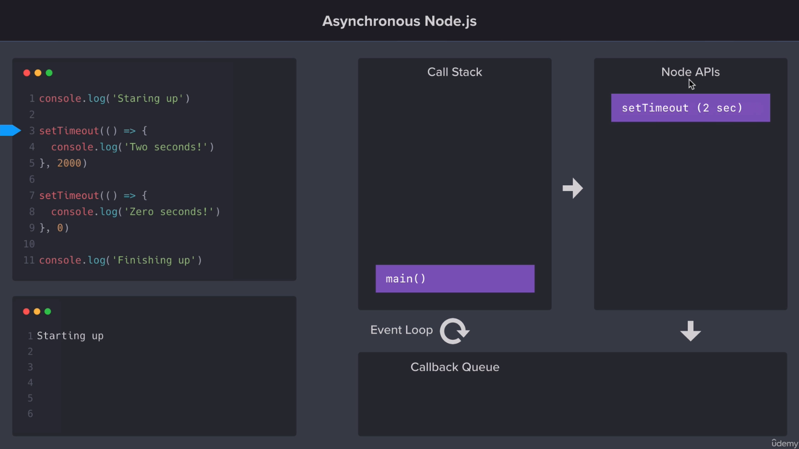

# NODE

## Install 

```bash
sudo snap install node --classic --channel 12/stable
node -v
npm -v
```

## Initialize a Project

```bash
npm init
```


```bash
npm install validator@10.8.0
npm uninstall validator
npm install chalk@2.4.1

node app.js

sudo npm install nodemon@1.18.5 -g
nodemon app.js
```

## Arguments

Use yargs

```bash
npm i yargs@12.0.2
node app.js --help
node app.js --version
node app.js add --title="Shopping lit"
```

## requests and web servers

```bash
npm i request@2.88.0
npm i express@4.16.4
npm i hbs@4.0.1
```

## Debugging

Add debugger in the code


Execute inspect


Open Chrome on chrome://inspect/


Press inspect


Press play buttom


Console


## Call Stack: Callback Queue and Event Loop

Example 1:


Example 2:


Example 3:





Run hds together node with nodemon

```bash
nodemon src/app.js -e js,hbs
```

Install Horoku

```bash
curl https://cli-assets.heroku.com/install.sh | sh
heroku -v
heroku login

heroku keys:add #add public to to heroku
cd web-server-node-js/

heroku create mead-weather-application

git push heroku main
```

Execute app node localy

```bash
chmod +x src/app.js
npm run start

npm run dev

npm install nodemon@1.2.0 --save-dev
```