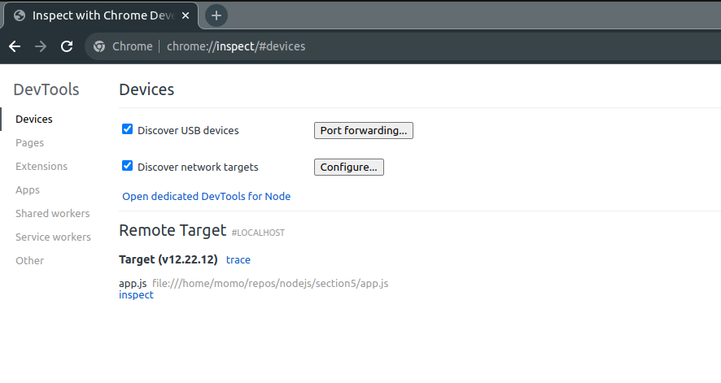

# NODE

## Install 

```bash
sudo snap install node --classic --channel 12/stable
node -v
npm -v
```

## Initialize a Project

```bash
npm init
```


```bash
npm install validator@10.8.0
npm uninstall validator
npm install chalk@2.4.1

node app.js

sudo npm install nodemon@1.18.5 -g
nodemon app.js
```

## Arguments

Use yargs

```bash
npm i yargs@12.0.2
node app.js --help
node app.js --version
node app.js add --title="Shopping lit"
```

## Debugging

Add debugger in the code


Execute inspect


Open Chrome on chrome://inspect/



Press inspect


Press play buttom


Console

